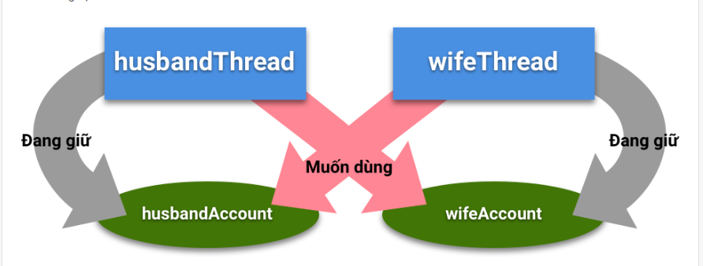

# NOTE :  Ví dụ về thread, multithread, monitor, schedule (Bao gồm các task ở VT) Ở mỗi package có file package-info miêu tả require example hoặc cách implement, giải thích

------------------------------------------------------------------------------------------------------------------------
## Phần 1: Thread cơ bản

### 1. Vòng đời của một Thread
- 
- 
-  Giải thích:
   + **NEW** : Trạng thái tạo mới của 1 Thread, chưa gọi phương thức start()
   + **RUNNABLE**: Trạng thái đưa Thread vào hàng đợi cấp tài nguyên ( Sau khi gọi phương thức start())
   + Trong quá trình Thread đang chạy, nếu có bất kỳ tác động nào đó (ngoại trừ làm kết thu vòng đời của Thread) Thread sẽ vào 1 trong 3  trạng thái BLOCK, WAITING, TIMED_WAITING
   + **BLOCKED** : Không có đủ điều kiện để chạy (Ví dụ trong một app đồng bộ, thì chỉ một Thread được sử dụng đến tài nguyên dùng chung, Các Thread còn lại sẽ phải chờ đợi cho THread ưu tiên kia sử dụng xong tài nguyên)
   + **WAITING** : Trạng thái Thread phải đợi 1 Thread nào đó hoàn thành tác vụ (Lưu ý là khác với BLOCKED)
   + **TIMED_WAITING** : Trạng thái Thread đợi 1 Thread nào đó trong 1 khoảng tgian xác định
   + **TERMINATED** : Trạng thái kết thúc vòng đời Thread


### 2. Cơ chế Monitor - Lock
- Hiều đơn giản là mỗi Thread nào đó sử dụng ta nguyên dùng chung thì sẽ có 1 lock và khi Thread chạy xong thì sẽ trả lại lock cho Monitor

###. Đồng bộ ngăn chặn (Mutual Exclusive ), Từ khóa synchronized
_**Soure code package**: com.hunglp.threadschedulemonitoroverview.learning_example.multithread.mulual_exclusive_

- Hiểu đơn giản là khi Thread cần truy cập 1 tài nguyên dùng chung thì cần có Monitor trao cho lock
- Khi Thread trên mà dùng tài nguyên xong thì sẽ trả lại lock, Khi đó lock sẽ lại được trao cho 1 Thread khác để tiếp tục dùng chung tài nguyên
- Do vậy 2 Thread ngăn chặn việc dùng chung tài nguyên cùng một lúc, Thread này phải đợi Thread kia dùng xong tài nguyên.
- synchronized block
```java
public void performSynchronisedTask() {
    synchronized (this) {
        setCount(getCount()+1);
    }
}
```
- synchronized instance method
```java
public synchronized void synchronisedCalculate() {
    setSum(getSum() + 1);
}
```
- synchronized static method
```java
public static synchronized void syncStaticCalculate() {
        staticSum = staticSum + 1;
        }
```
### 4. Đồng bộ cộng tác (MultiThread Cooperation)
_**Soure code package**: com.hunglp.threadschedulemonitoroverview.learning_example.multithread.multithread_cooperation_
- wait() : Khi phương thức này được gọi, nó sẽ làm cho Thread đang nắm giữa Lock đối tượng phải trả lại Lock cho Monitor, và Thread sẽ rơi vào trạng thái ngủ, hoặc Thread sẽ tự thức dậy nếu dùng hàm wait(long timeoutMilis)
- notify() : Phương thức này đánh thức Thread đang trong tranạng thái ngủ và khi đó trạng thái sẽ là RUNNABLE
- notifyAll() : Đánh thức tất cả các Thread() đang bị ngủ bởi phương thức wait()

### 5. Deadlock
- Deadlock xuất hiện khi quá lạm dụng synchronized. Làm cho các Thread nắm giữ các đối tượng dùng chung mãi mãi ko chịu trả ra cho đối tượng khác dùng
- 
- _**Soure code package**: com.hunglp.threadschedulemonitoroverview.learning_example.multithread.deadlock_
